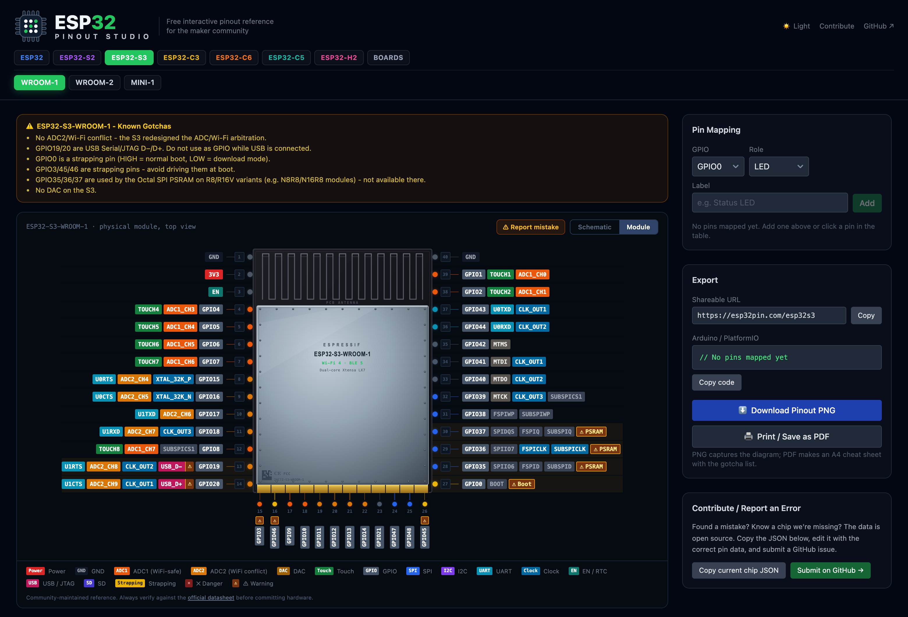

<p align="center">
  
</p>

# ESP32 Pinout Studio

**Live at [esp32pin.com](https://esp32pin.com)** - a free, interactive pinout reference for the whole ESP32 family, built for the maker community.



Pick the wrong pin on an ESP32 and your project boots into download mode, crashes when Wi-Fi starts, or bricks the flash bus. This site exists so that doesn't happen: every pin carries its constraints (strapping pins, ADC2/Wi-Fi conflicts, flash-reserved GPIOs, input-only pins, USB/JTAG lines) right on the diagram.

## Features

- **Schematic view**: the official Espressif KiCad symbol for each module, rendered as an EDA-style sheet with verbatim pin names and high-visibility warnings.
- **Module view**: a realistic top-down rendering of the physical module with its castellated pads.
- **23 modules and dev boards** across ESP32, S2, S3, C3, C5, C6, and H2, each with its real physical pad layout.
- **Pin mapping builder** with live conflict detection, Arduino `#define` export, shareable URLs, and PNG export.
- **Filters** for Wi-Fi-safe ADC, safe outputs, touch, strapping, and unconstrained pins.

## Data provenance

Pin names, physical pad layouts, and schematic symbols are generated from [Espressif's official KiCad libraries](https://github.com/espressif/kicad-libraries) - not hand-copied from datasheets:

```sh
git clone --depth 1 https://github.com/espressif/kicad-libraries
KICAD_LIB=./kicad-libraries node scripts/generate-chip-data.mjs
```

`src/data/chips/generated.ts` is the output; do not edit it by hand. Family-level lore KiCad doesn't encode (strapping pins, boot modes, ADC2/Wi-Fi arbitration, flash-bus rules) lives in the generator's `FAM` table and in `src/data/chips/catalog.ts`.

## Found a mistake?

Use the **Report mistake** button on the site (it prefills an issue with the chip and pin context), or [open an issue](https://github.com/FelixKunzJr/ESPPinoutWebsite/issues/new) directly. Corrections with a datasheet reference are merged fast.

## Development

```sh
npm install
npm run dev     # local dev server
npm test        # vitest
npm run build   # production build
```

Pushes to `main` auto-deploy via Vercel.

## License

MIT (see [LICENSE](LICENSE)). Pin data and symbols derive from Espressif's KiCad libraries (Apache 2.0). ESP32 is a trademark of Espressif Systems; this project is not affiliated with or endorsed by Espressif.

Always verify pinouts against the official datasheet before committing hardware.
